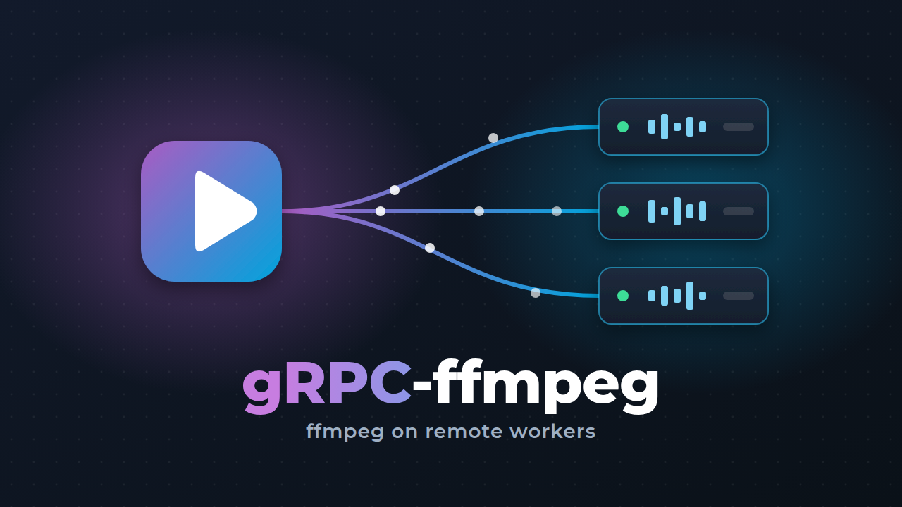
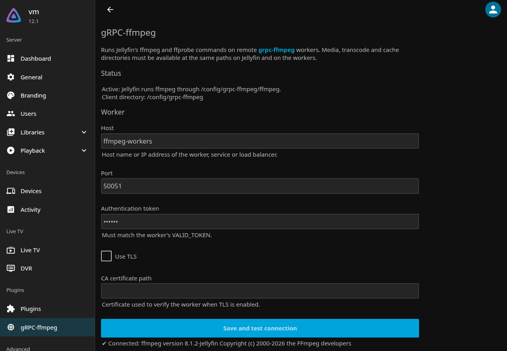
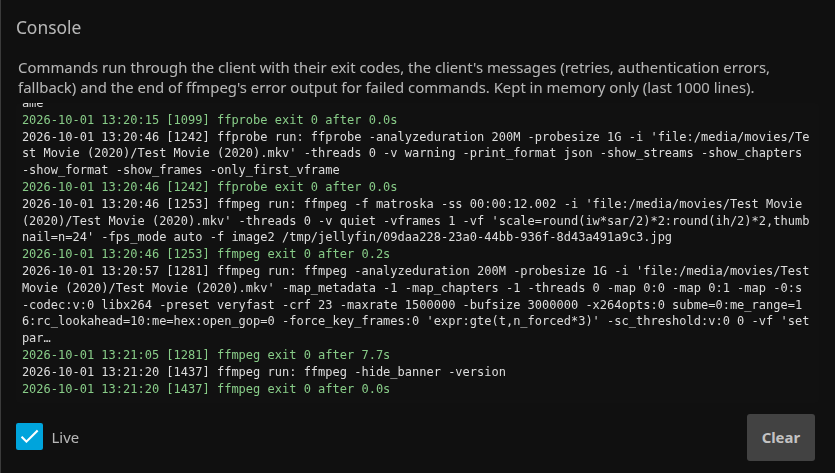

# Jellyfin.Plugin.GrpcFfmpeg



Runs Jellyfin's `ffmpeg` and `ffprobe` commands on remote
[grpc-ffmpeg](https://github.com/CrystalNET-org/grpc-ffmpeg) workers: transcoding, probing,
image extraction and anything plugins run through ffmpeg (`mediainfo` and `vainfo` are
relayed as well).

It works with the official Jellyfin images and packages. No custom image, no environment
variables and no manual `JELLYFIN_FFMPEG` change are needed.

> This plugin is still young. Test it on a non-critical server first.

## Screenshots

The settings page, reached through **gRPC-ffmpeg** in the dashboard sidebar, with a
successful connection test:



The live console below it lists every command run through the client: a library scan's
probe, an image extraction and a transcode, each with its exit code and duration:



## Requirements

- Jellyfin 10.11 or 12.x on Linux (amd64 or arm64). A Windows (amd64) client is included
  but not yet tested with Jellyfin.
- One or more [grpc-ffmpeg workers](https://github.com/CrystalNET-org/grpc-ffmpeg#quick-start-with-jellyfin)
  reachable from Jellyfin. Use workers with the same ffmpeg major version as Jellyfin's own
  ffmpeg (see *Fallback* under [How it works](#how-it-works)): grpc-ffmpeg `8.1.3-7.8` or later for Jellyfin 12,
  up to `7.1.4-7.7` for Jellyfin 10.11.
- **Shared paths:** the media library and Jellyfin's transcode and cache directories must be
  mounted at the same paths on Jellyfin and on every worker (e.g. over NFS). The worker
  reads and writes those files directly.

## Installation

1. In Jellyfin, open *Dashboard → Plugins → Repositories*, add
   `https://raw.githubusercontent.com/CrystalNET-org/Jellyfin.Plugin.GrpcFfmpeg/main/manifest.json`,
   and install **gRPC-ffmpeg** from the catalog.
   To install manually instead, extract a release zip into a folder in Jellyfin's
   `plugins` directory.
2. Restart Jellyfin.
3. Open **gRPC-ffmpeg** in the dashboard sidebar, below *Plugins*. Enter the worker's host,
   port and token (the worker's `VALID_TOKEN`), then click **Save and test connection**.
4. Tick **Use gRPC workers for ffmpeg**, save, and restart Jellyfin.

The status on the settings page shows which ffmpeg Jellyfin uses. After the restart,
Jellyfin's log shows `FFmpeg: <data dir>/grpc-ffmpeg/ffmpeg`, and `Found ffmpeg version`
reports the workers' version.

### Switching from a custom image

If Jellyfin runs in an image that already contains a grpc-ffmpeg client (such as
[CrystalNET-org/jellyfin](https://github.com/CrystalNET-org/jellyfin)), the plugin replaces it:

- **Remove the client's environment variables** (`GRPC_HOST`, `AUTH_TOKEN`, ...) from the
  container. Environment variables override the client's config file, so they would take
  precedence over the plugin's settings.
- **Set the fallback directory** on the settings page to the local ffmpeg's directory, e.g.
  `/usr/lib/jellyfin-ffmpeg`, as long as the image's own client is still Jellyfin's ffmpeg.
  Otherwise the fallback runs that client, which tries the workers again.
- On the official image, neither is needed.

## How it works

- On every start, the plugin extracts the grpc-ffmpeg client embedded in it to
  `<data dir>/grpc-ffmpeg/` (e.g. `/config/grpc-ffmpeg/` in the official image). It then
  links it as `ffmpeg`, `ffprobe`, `mediainfo` and `vainfo`, and writes the settings to
  `grpc-ffmpeg.conf` next to it. Changed settings apply to the next command without a restart.
- Jellyfin takes the ffmpeg path from `--ffmpeg` / `JELLYFIN_FFMPEG` (which the official
  images set) before `encoding.xml`, so a plugin cannot change it through the settings. When
  the relay is enabled, the plugin instead registers Jellyfin's own `MediaEncoder` with the
  ffmpeg path pointing at the client. This registration replaces Jellyfin's. Enabling or
  disabling the relay therefore needs a restart. When disabled, Jellyfin behaves as if the
  plugin was not installed.
- **Fallback:** Jellyfin refuses to start if its ffmpeg check fails. By default, the client
  runs a command with the local ffmpeg if no worker is reachable. The local ffmpeg is the one
  Jellyfin would use without the plugin, or the directory set on the settings page. Jellyfin
  keeps working (and starting) while the workers are down. Lower **Attempts before giving up**
  to make the fallback kick in faster. Jellyfin picks ffmpeg options by the version it detects
  at startup, from the workers or, if they are down, from the local ffmpeg. That is why both
  should have the same major version.

## Console

The settings page has a live console with every command run through the client: its exit
code, duration, the client's own messages (retries, authentication errors, fallback) and
the last lines of ffmpeg's error output for failed commands. Jellyfin discards that output
for many calls, e.g. its startup checks. On Linux the clients write to a named pipe
(`console.fifo` in the client directory) that the plugin reads into memory, so nothing is
written to disk. While Jellyfin is not reading it, the clients drop their lines without
waiting. On Windows a log file (`grpc-ffmpeg.log`, rotated at 1 MB) is used instead.

## Troubleshooting

- **Test fails with `Unauthenticated: Invalid token`:** the token does not match the worker's
  `VALID_TOKEN`.
- **Test fails with `Unavailable`:** the worker's host or port is wrong, or it is not reachable
  from Jellyfin.
- **Status says a restart is required:** the activation setting changed since Jellyfin started.
- **Commands fail on the worker with "No such file or directory":** the paths are not shared,
  see Requirements.
- **The console shows `exit 1` for `-init_hw_device` commands at startup:** that is how Jellyfin
  probes VAAPI and Vulkan. These commands have no input or output, so ffmpeg always exits with 1;
  Jellyfin reads the driver details from their error output.
- Check the console on the settings page first. Jellyfin also logs the plugin's decisions at
  startup (search the log for `gRPC-ffmpeg`), and the worker logs every command and rejected
  call.

## Building

Needs the .NET 9 SDK. The plugin builds against the Jellyfin 10.11 packages and runs on
Jellyfin 12 too.

```bash
dotnet build -c Release Jellyfin.Plugin.GrpcFfmpeg/Jellyfin.Plugin.GrpcFfmpeg.csproj
```

The build downloads the grpc-ffmpeg client binaries of the release set in
`GrpcFfmpegVersion` (in the `.csproj`) and embeds them. To embed local builds instead, pass
`-p:GrpcFfmpegAssetsDir=/path/to/dir/`. The directory must contain `grpc-ffmpeg-client-amd64`,
`grpc-ffmpeg-client-arm64` and optionally `grpc-ffmpeg-client-windows-amd64.exe`.

The output is `Jellyfin.Plugin.GrpcFfmpeg/bin/Release/net9.0/Jellyfin.Plugin.GrpcFfmpeg.dll`.

## Plugin repository

`manifest.json` on `main` is the plugin repository file for Jellyfin:

```
https://raw.githubusercontent.com/CrystalNET-org/Jellyfin.Plugin.GrpcFfmpeg/main/manifest.json
```

Each release adds itself to it, with the commit titles since the previous release as its
changelog. Jellyfin then offers the update in the plugin catalog.

## Releasing

Push a tag such as `0.2.1`. CI builds the plugin as version `0.2.1.0`, publishes
`gRPC-ffmpeg_0.2.1.0.zip` as a GitHub release, and adds it to `manifest.json` on `main` (that
commit skips CI). The catalog image is `images/thumb.png`, through `imageUrl` in `manifest.json`;
the release zip contains it as well, for the installed plugin's page.

Dependency updates are released automatically:

1. Renovate opens PRs for new grpc-ffmpeg releases (one hour after release, once the client
   binaries are published) and for Jellyfin package patch updates.
2. The build pipeline builds the plugin for the PR, and Renovate merges it once it passes.
3. On `main`, once the build succeeded, `.woodpecker/auto_release.yaml` pushes the next patch
   tag (e.g. `0.2.2`) if the embedded grpc-ffmpeg release or the Jellyfin packages differ from
   the latest release (`scripts/next-release-tag.sh`).

Renovate runs through `.woodpecker/renovate.yaml`; it needs a cron job in Woodpecker.
